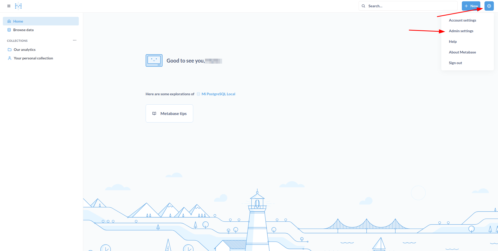
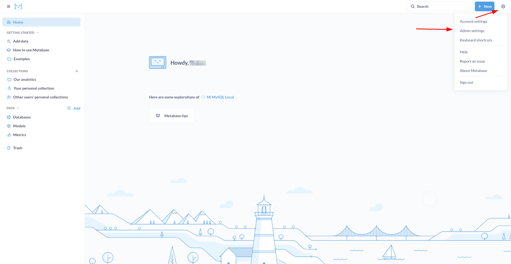
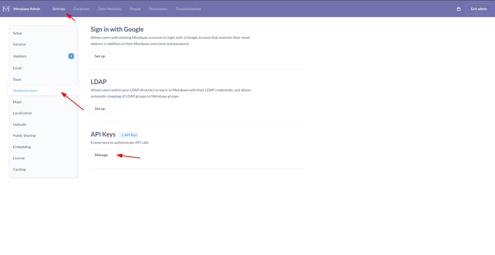
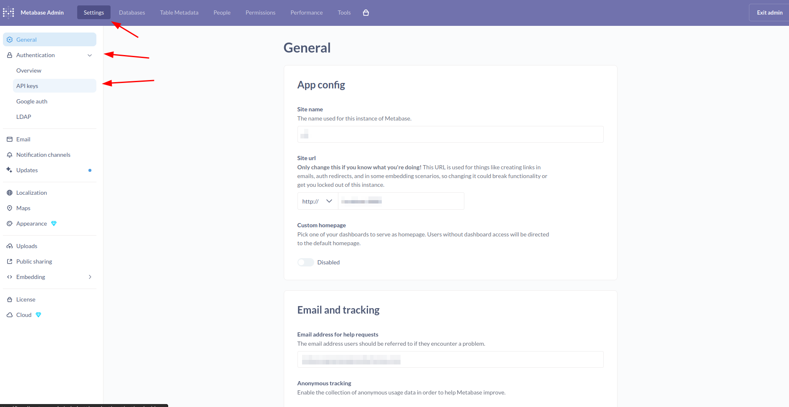
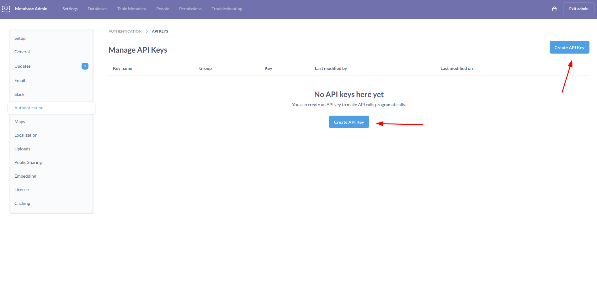
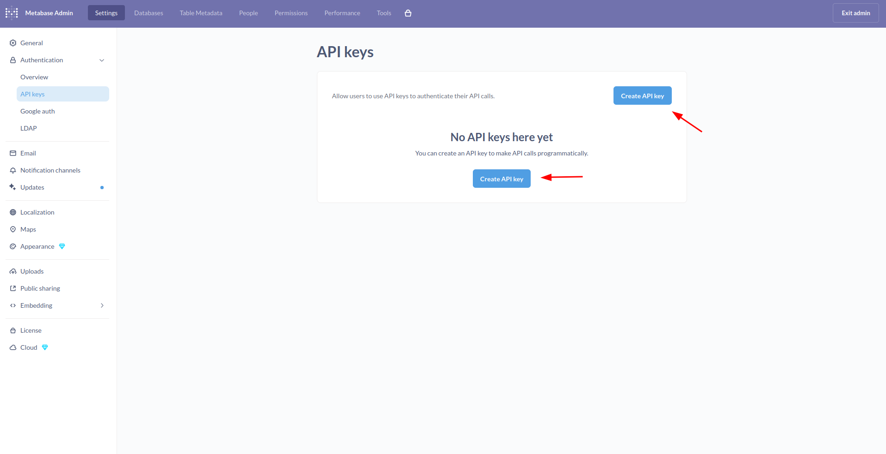
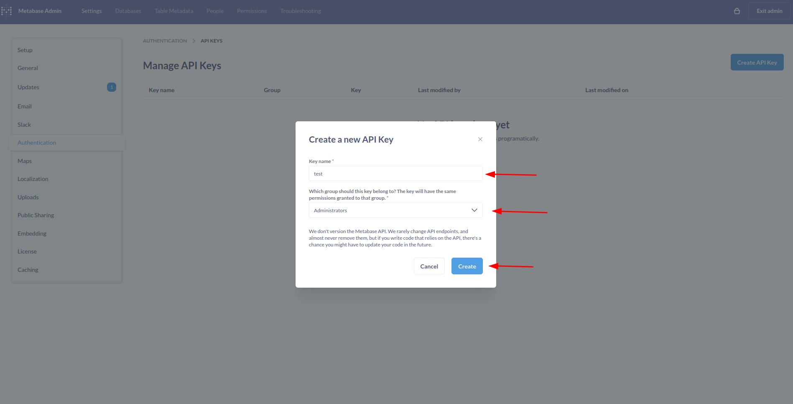
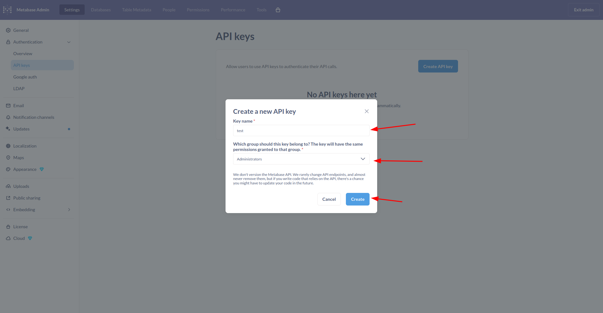
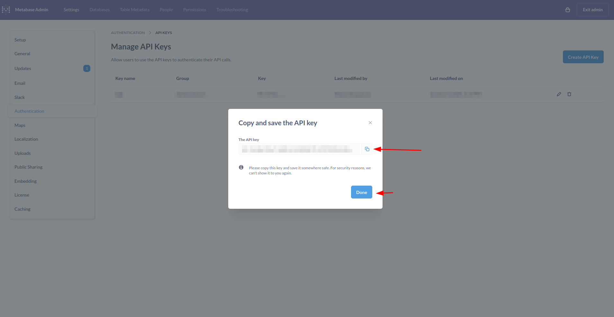
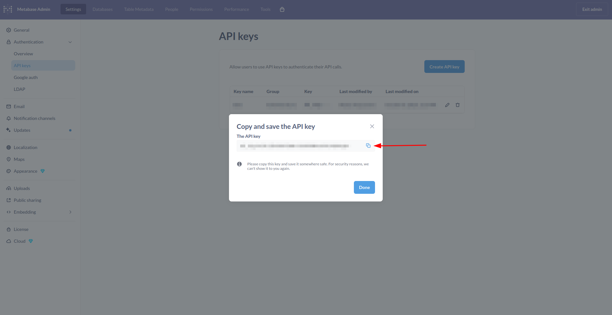

## Connector capabilities

1. What resources does the connector sync?
   The connector syncs users and groups from Metabase.

2. Can the connector provision any resources? If so, which ones?
   No.

## Connector requirements
This connector requires the open source version Metabase v0.49.x or v0.56.x to be downloaded in order to function correctly.
* Official release: https://github.com/metabase/metabase/releases/tag/v0.49.0
                    https://github.com/metabase/metabase/releases/tag/v0.56.0-beta

* Docker Hub image: https://hub.docker.com/r/metabase/metabase/tags?page=1&name=v0.49.0
                    https://hub.docker.com/r/metabase/metabase/tags?name=v0.56.0

  Example (Docker):
  v0.49.0:
  ```
  docker run -d -p 3000:3000 \
  --name metabase \
  metabase/metabase:v0.49.0
  ```
  v0.56.0:
  ```
  docker run -d -p 3000:3000 \
  --name metabase \
  metabase/metabase:v0.56.0-beta
  ```
This command starts Metabase and exposes it on port 3000 of the server.
The connector requires the --metabase-base-url parameter, which should be set to the URL where this Metabase instance is accessible (e.g., https://metabase.customer.com for production).
For example:
If Metabase is running on a server with domain metabase.customer.com and port 443 (HTTPS), the base URL would be:
   * --metabase-base-url https://metabase.customer.com

## Connector credentials
1. What credentials or information are needed to set up the connector? (For example, API key, client ID and secret, domain, etc.)

   Requires a base URL and an API Key. Args: --metabase-base-url, --metabase-api-key

   The required URL was defined in the connector requirements instructions
   To obtain the API key follow the next steps:  
   1. In your Metabase address where the open source version was launched, click on the gear icon in the upper right section and click on admin settings:
      v0.49:
      
      v0.56:   
      
   
   2. Click on authentication and API keys, then click on manage:
      v0.49:
      
      v0.56:
      

   3. Click on create API key:
      v0.49:
      
      v0.56:
      

   4. Fill in the required fields:
      * Key name: Enter any descriptive name (e.g. baton-connector). 
      * Group: Select the administrators group as this will allow you to synchronize all connector resources with the API key. 
      * Create the API key.
      v0.49:
      
      v0.56:
      

   5. Save your API key as you will not be able to view it again:
      v0.49:
      
      v0.56:
      

   

